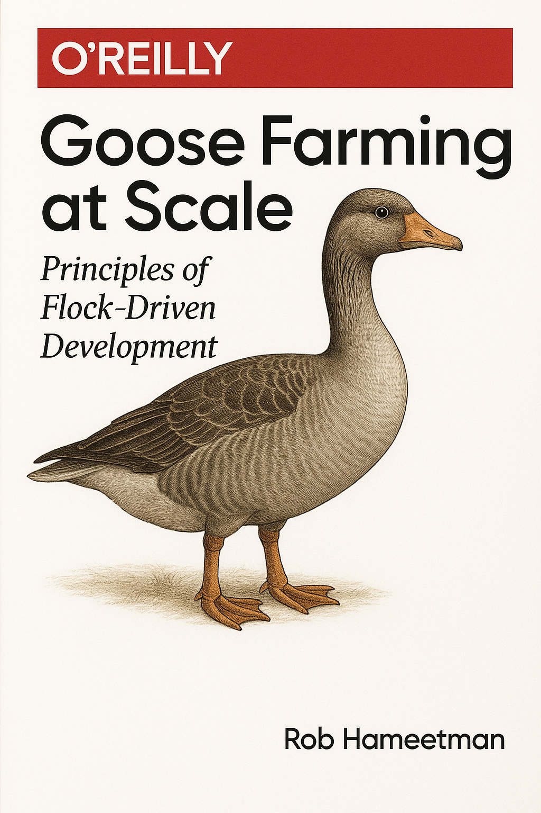

[separator=::]
= Book Title Here
:doctype: book
:author: Rob Hameetman
:creator: {author}
:copyright: 2025 {author}
:email: your.email@example.com
:description: HTML meta tag content for description
:keywords: HTML meta tag content for keywords
:front-cover-image: 
:isbn: 978-1-23456-789-0

// Publish
:editors:
:production-editor:
:copyeditor: 
:proofreader:
:indexer:
:cover-designer:
:interior-designer:
:illustrator:
:technical-reviewers: 

// Version
:revnumber: v1.0
:revdate: 01.01.2025
:revremark: First draft

// Formatting
:encoding: utf-8
:tabsize: 4
:experimental:
:part-signifier: "Part"
:part-title-style: title
:chapter-signifier: "Chapter"
:chapter-title-style: title
:appendix-signifier: "Appendix"
:appendix-title-style: title
:xrefstyle: short

// Numbering
:sectnumlevels: 3
:leveloffset: +1
:sectnums:
:sectlinks:
:figure-number: 
:table-number: 
:example-number: 

// Media
:imagesdir: ./images
:stylesdir: ./styles

// Admonition (O'Reilly style)
:caution-caption: ⚠️ Caution
:important-caption: 💡 Important
:note-caption: 📝 Note
:tip-caption: 🚀 Tip
:warning-caption: ⚠️ Warning

// eBook Settings
ifdef::ebook[]
:page-breaks:
:notitle:
:nofooter:
endif::ebook[]

// PDF Settings
:pdf-themesdir: {docdir}/../publish/themes
:pdf-fontsdir: {docdir}/../publish/fonts
:pdf-theme: basic
:pdfmark: true

// Print Settings
ifdef::print[]
:title-page:
:showlinks:
:media: print
endif::print[]

// Code Samples
:code-sample-caption: Example
:code-sample-signifier: "Example"
:source-highlighter: rouge
:source-language: javascript
:rouge-style: github
:rouge-css: class
:rouge-linenums-mode: table
:prewrap:
:icons: font

// Exercise/Solution Formatting
:exercise-caption: Exercise
:solution-caption: Solution
:practice-caption: Practice

// O'Reilly-specific Conventions
:oreilly: 
:ext-relative: 
:ext-include: 
:ext-plantuml: 

// Macros
:oreilly-tip: macro
:oreilly-note: macro
:oreilly-warning: macro

// Table of Contents
:toc-title: Table of Contents
:toclevels: 4
:toc: left

// Content
include::{docdir}/preface.adoc[]
include::{docdir}/chapter-1/chapter.adoc[]
include::{docdir}/chapter-2/chapter.adoc[]
include::{docdir}/chapter-3/chapter.adoc[]
include::{docdir}/appendix.adoc[]
